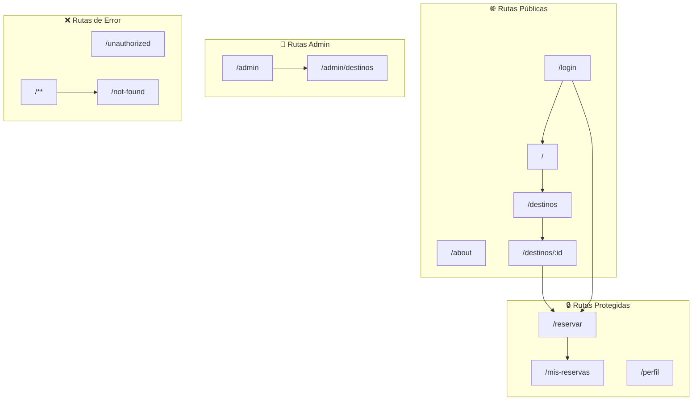
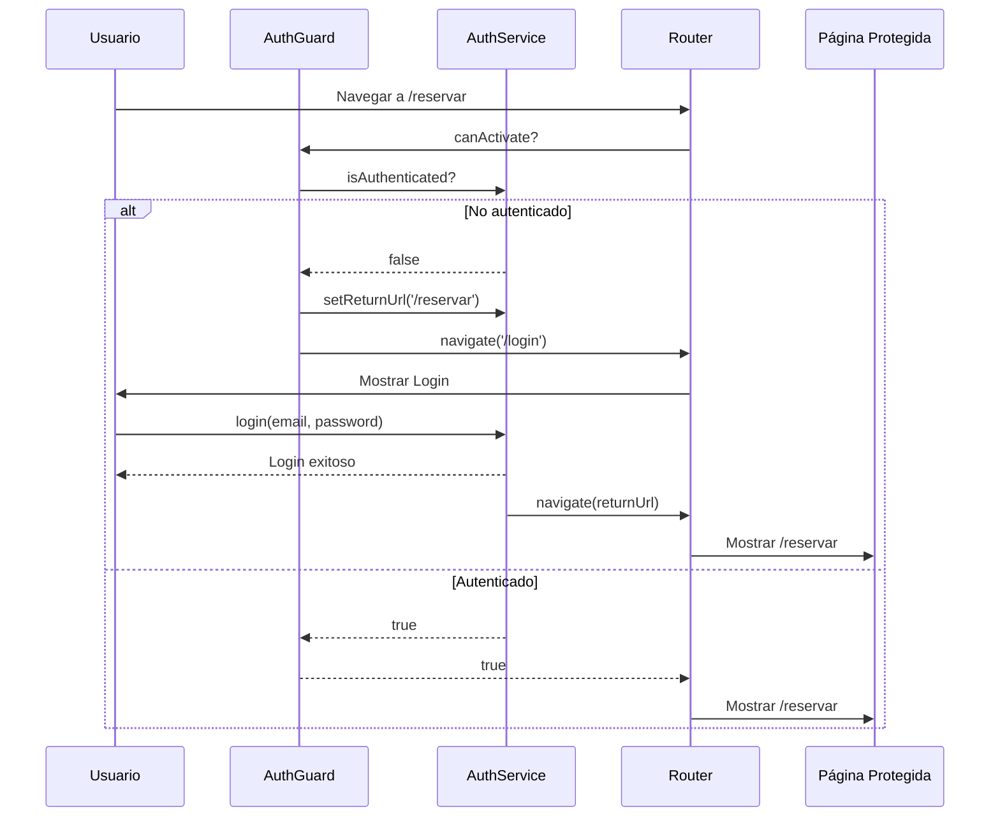

# Documentación Técnica - Fase 4: Sistema de Routing en Angular

## Índice
1. [Configuración de Rutas](#configuración-de-rutas)
2. [Navegación Programática](#navegación-programática)
3. [Lazy Loading](#lazy-loading)
4. [Route Guards](#route-guards)
5. [Resolvers](#resolvers)
6. [Breadcrumbs Dinámicos](#breadcrumbs-dinámicos)
7. [Mapa de Rutas](#mapa-de-rutas)

---

## Configuración de Rutas

### Archivo de Rutas Principal

**Ubicación**: `src/app/app.routes.ts`

La configuración de rutas de T4 Traveling implementa todas las funcionalidades avanzadas de Angular Router:

```typescript
import { Routes } from '@angular/router';
import { authGuard, adminGuard, guestGuard } from './guards/auth.guard';
import { unsavedChangesGuard } from './guards/unsaved-changes.guard';
import { destinationResolver, destinationsListResolver } from './resolvers/destination.resolver';

export const routes: Routes = [
  // Rutas principales
  {
    path: '',
    loadComponent: () => import('./pages/home/home.component').then(m => m.HomeComponent),
    data: { breadcrumb: 'Inicio' }
  },
  
  // Rutas con parámetros
  {
    path: 'destinos/:id',
    loadComponent: () => import('./pages/destination-detail/destination-detail.component'),
    resolve: { destination: destinationResolver }
  },
  
  // Rutas protegidas
  {
    path: 'reservar',
    loadComponent: () => import('./pages/booking/booking.component'),
    canActivate: [authGuard],
    canDeactivate: [unsavedChangesGuard]
  },
  
  // Ruta wildcard (404)
  {
    path: '**',
    redirectTo: 'not-found'
  }
];
```

### Tipos de Rutas Implementadas

| Tipo | Ejemplo | Descripción |
|------|---------|-------------|
| **Principal** | `/` | Página de inicio |
| **Listado** | `/destinos` | Lista de destinos |
| **Detalle con parámetro** | `/destinos/:id` | Detalle de un destino |
| **Rutas hijas** | `/admin/destinos` | Subrutas anidadas |
| **Protegida** | `/reservar` | Requiere autenticación |
| **Admin** | `/admin/*` | Requiere rol admin |
| **Wildcard** | `**` | Captura rutas no existentes |

### Rutas con Parámetros

```typescript
// Definición de ruta con parámetro
{
  path: 'destinos/:id',
  loadComponent: () => import('./pages/destination-detail/destination-detail.component'),
  resolve: { destination: destinationResolver }
}

// Acceso al parámetro en el componente
@Component({...})
export class DestinationDetailComponent {
  private route = inject(ActivatedRoute);
  
  ngOnInit() {
    // Forma 1: Snapshot (valor único)
    const id = this.route.snapshot.paramMap.get('id');
    
    // Forma 2: Observable (cambios reactivos)
    this.route.paramMap.subscribe(params => {
      const id = params.get('id');
    });
    
    // Forma 3: Con @Input() (requiere withComponentInputBinding)
    @Input() id!: string;
  }
}
```

### Rutas Hijas Anidadas

```typescript
{
  path: 'destinos',
  data: { breadcrumb: 'Destinos' },
  children: [
    {
      path: '',           // /destinos
      loadComponent: () => import('./pages/destinations/destinations.component')
    },
    {
      path: ':id',        // /destinos/1
      loadComponent: () => import('./pages/destination-detail/destination-detail.component'),
      data: {
        breadcrumb: (data: any) => data['destination']?.name
      }
    }
  ]
}
```

---

## Navegación Programática

### Router Service

El servicio `Router` permite navegar programáticamente desde el código TypeScript:

```typescript
import { Router, ActivatedRoute } from '@angular/router';

@Component({...})
export class MyComponent {
  private router = inject(Router);
  private route = inject(ActivatedRoute);
  
  // Navegación simple
  goToHome(): void {
    this.router.navigate(['/']);
  }
  
  // Navegación con parámetros de ruta
  goToDestination(id: string): void {
    this.router.navigate(['/destinos', id]);
  }
  
  // Navegación relativa
  goToChild(): void {
    this.router.navigate(['child'], { relativeTo: this.route });
  }
  
  // Navegación con query params
  searchDestinations(query: string): void {
    this.router.navigate(['/destinos'], {
      queryParams: { search: query, sort: 'price' }
    });
  }
  
  // Navegación con fragment
  goToSection(): void {
    this.router.navigate(['/about'], { fragment: 'contact' });
  }
  
  // Navegación con state (datos temporales)
  goToBooking(destination: Destination): void {
    this.router.navigate(['/reservar'], {
      state: { destination }
    });
  }
}
```

### NavigationExtras

```typescript
interface NavigationExtras {
  // Query params (?key=value)
  queryParams?: { [key: string]: any };
  
  // Fragment (#section)
  fragment?: string;
  
  // Preservar/combinar query params
  queryParamsHandling?: 'merge' | 'preserve' | '';
  
  // Estado temporal (no en URL)
  state?: { [key: string]: any };
  
  // Relativo a una ruta
  relativeTo?: ActivatedRoute;
  
  // Forzar recarga
  skipLocationChange?: boolean;
  replaceUrl?: boolean;
}

// Ejemplo completo
this.router.navigate(['/destinos', destinationId], {
  queryParams: { 
    from: 'home',
    promocode: 'SUMMER2024'
  },
  fragment: 'booking-form',
  state: {
    destination: this.selectedDestination,
    previousUrl: this.router.url
  },
  queryParamsHandling: 'merge'
});
```

### Acceso a Navigation State

```typescript
// En el componente destino
constructor() {
  // Acceder al state pasado
  const navigation = this.router.getCurrentNavigation();
  const state = navigation?.extras.state as { destination: Destination };
  
  // O desde window.history
  const historyState = window.history.state;
}
```

### Query Params y Fragments

```typescript
// En el componente
@Component({...})
export class SearchComponent {
  private route = inject(ActivatedRoute);
  
  ngOnInit() {
    // Observar cambios en query params
    this.route.queryParams.subscribe(params => {
      this.searchQuery = params['search'];
      this.sortBy = params['sort'] || 'name';
    });
    
    // Observar fragment
    this.route.fragment.subscribe(fragment => {
      if (fragment) {
        document.getElementById(fragment)?.scrollIntoView();
      }
    });
  }
}
```

---

## Lazy Loading

### Estrategia de Carga Perezosa

T4 Traveling implementa lazy loading para optimizar el tiempo de carga inicial:

```typescript
// app.routes.ts - Todos los componentes usan loadComponent
{
  path: 'destinos',
  loadComponent: () => import('./pages/destinations/destinations.component')
    .then(m => m.DestinationsComponent)
}
```

### Configuración de Precarga

**Ubicación**: `src/app/app.config.ts`

```typescript
import { 
  provideRouter, 
  withPreloading, 
  PreloadAllModules 
} from '@angular/router';

export const appConfig: ApplicationConfig = {
  providers: [
    provideRouter(
      routes,
      // Precarga todos los módulos después del inicial
      withPreloading(PreloadAllModules),
      // Permite @Input() para params de ruta
      withComponentInputBinding()
    )
  ]
};
```

### Estrategias de Precarga Disponibles

| Estrategia | Descripción | Uso |
|------------|-------------|-----|
| `NoPreloading` | Sin precarga | Apps pequeñas |
| `PreloadAllModules` | Precarga todo en background | **Recomendado** |
| `QuicklinkStrategy` | Precarga enlaces visibles | Optimización avanzada |
| Custom | Estrategia personalizada | Casos específicos |

### Verificación de Chunking

Para verificar que lazy loading funciona correctamente:

```bash
# Build de producción
npm run build

# Verificar chunks generados
ls dist/t4traveling/browser/*.js
```

Resultado esperado:
```
main-XXXXX.js           # Bundle principal
polyfills-XXXXX.js      # Polyfills
chunk-XXXXX.js          # HomeComponent (lazy)
chunk-XXXXX.js          # DestinationsComponent (lazy)
chunk-XXXXX.js          # BookingComponent (lazy)
...
```

### Análisis de Bundle

```bash
# Instalar source-map-explorer
npm install -g source-map-explorer

# Analizar bundle
ng build --source-map
source-map-explorer dist/t4traveling/browser/*.js
```

---

## Route Guards

### AuthGuard (CanActivate)

**Ubicación**: `src/app/guards/auth.guard.ts`

Protege rutas que requieren autenticación:

```typescript
import { inject } from '@angular/core';
import { CanActivateFn, Router } from '@angular/router';
import { AuthService } from '../services/auth.service';

export const authGuard: CanActivateFn = (route, state) => {
  const authService = inject(AuthService);
  const router = inject(Router);

  if (authService.isAuthenticated()) {
    return true;
  }

  // Guardar URL para redirigir después del login
  authService.setReturnUrl(state.url);
  
  router.navigate(['/login'], {
    queryParams: { returnUrl: state.url }
  });
  
  return false;
};
```

### AdminGuard

Verifica rol de administrador:

```typescript
export const adminGuard: CanActivateFn = (route, state) => {
  const authService = inject(AuthService);
  const router = inject(Router);

  if (!authService.isAuthenticated()) {
    router.navigate(['/login']);
    return false;
  }

  if (!authService.hasRole('admin')) {
    router.navigate(['/unauthorized']);
    return false;
  }

  return true;
};
```

### GuestGuard

Solo permite acceso a usuarios NO autenticados:

```typescript
export const guestGuard: CanActivateFn = () => {
  const authService = inject(AuthService);
  const router = inject(Router);

  if (authService.isAuthenticated()) {
    router.navigate(['/']);
    return false;
  }

  return true;
};
```

### UnsavedChangesGuard (CanDeactivate)

**Ubicación**: `src/app/guards/unsaved-changes.guard.ts`

Previene pérdida de datos en formularios:

```typescript
// Interfaz que deben implementar los componentes
export interface CanComponentDeactivate {
  canDeactivate: () => boolean | Promise<boolean>;
  hasUnsavedChanges?: () => boolean;
}

export const unsavedChangesGuard: CanDeactivateFn<CanComponentDeactivate> = (
  component
) => {
  if (!component?.canDeactivate) {
    return true;
  }
  return component.canDeactivate();
};
```

Implementación en componente:

```typescript
@Component({...})
export class BookingFormComponent implements CanComponentDeactivate {
  form: FormGroup;
  
  hasUnsavedChanges(): boolean {
    return this.form.dirty && !this.form.submitted;
  }
  
  canDeactivate(): boolean {
    if (this.hasUnsavedChanges()) {
      return confirm('Tienes cambios sin guardar. ¿Deseas salir?');
    }
    return true;
  }
}
```

### Uso en Rutas

```typescript
{
  path: 'reservar',
  loadComponent: () => import('./pages/booking/booking.component'),
  canActivate: [authGuard],           // Verificar antes de entrar
  canDeactivate: [unsavedChangesGuard] // Verificar antes de salir
}
```

---

## Resolvers

### DestinationResolver

**Ubicación**: `src/app/resolvers/destination.resolver.ts`

Precarga datos antes de activar la ruta:

```typescript
import { inject } from '@angular/core';
import { ResolveFn, Router } from '@angular/router';
import { catchError, of } from 'rxjs';
import { DestinationService, Destination } from '../services/destination.service';

export const destinationResolver: ResolveFn<Destination | null> = (route) => {
  const destinationService = inject(DestinationService);
  const router = inject(Router);
  
  const id = route.paramMap.get('id');
  
  if (!id) {
    router.navigate(['/destinos']);
    return of(null);
  }

  return destinationService.getDestinationById(id).pipe(
    catchError((error) => {
      console.error('Error al cargar destino:', error);
      router.navigate(['/not-found']);
      return of(null);
    })
  );
};
```

### Acceso a Datos Resueltos

```typescript
@Component({...})
export class DestinationDetailComponent {
  private route = inject(ActivatedRoute);
  
  destination: Destination;
  
  constructor() {
    // Acceso síncrono vía snapshot
    this.destination = this.route.snapshot.data['destination'];
    
    // O acceso reactivo vía observable
    this.route.data.subscribe(data => {
      this.destination = data['destination'];
    });
  }
}
```

### Loading State Durante Resolución

```typescript
// En app.component.ts
@Component({
  template: `
    <app-loading-spinner *ngIf="isNavigating"></app-loading-spinner>
    <router-outlet></router-outlet>
  `
})
export class AppComponent {
  private router = inject(Router);
  isNavigating = false;
  
  constructor() {
    this.router.events.subscribe(event => {
      if (event instanceof NavigationStart) {
        this.isNavigating = true;
      }
      if (event instanceof NavigationEnd || 
          event instanceof NavigationCancel ||
          event instanceof NavigationError) {
        this.isNavigating = false;
      }
    });
  }
}
```

---

## Breadcrumbs Dinámicos

### BreadcrumbService

**Ubicación**: `src/app/services/breadcrumb.service.ts`

Genera breadcrumbs automáticamente desde la configuración de rutas:

```typescript
@Injectable({ providedIn: 'root' })
export class BreadcrumbService {
  private breadcrumbsSubject = new BehaviorSubject<Breadcrumb[]>([]);
  public breadcrumbs$ = this.breadcrumbsSubject.asObservable();

  constructor(private router: Router) {
    this.router.events.pipe(
      filter(event => event instanceof NavigationEnd)
    ).subscribe(() => {
      const breadcrumbs = this.createBreadcrumbs(
        this.router.routerState.snapshot.root
      );
      this.breadcrumbsSubject.next(breadcrumbs);
    });
  }
  
  private createBreadcrumbs(
    route: ActivatedRouteSnapshot,
    url: string = '',
    breadcrumbs: Breadcrumb[] = []
  ): Breadcrumb[] {
    // Recursivamente construye breadcrumbs desde data.breadcrumb
    // ...
  }
}
```

### Configuración en Rutas

```typescript
// Breadcrumb estático
{
  path: 'destinos',
  data: { 
    breadcrumb: 'Destinos',
    breadcrumbIcon: '🌍'
  }
}

// Breadcrumb dinámico (basado en datos resueltos)
{
  path: ':id',
  resolve: { destination: destinationResolver },
  data: {
    breadcrumb: (data: any) => data['destination']?.name || 'Detalle'
  }
}
```

### BreadcrumbComponent

**Ubicación**: `src/app/components/shared/breadcrumb/breadcrumb.component.ts`

```html
<nav class="breadcrumb" aria-label="Breadcrumb">
  <ol class="breadcrumb__list">
    <li class="breadcrumb__item">
      <a routerLink="/">Inicio</a>
    </li>
    <li *ngFor="let crumb of breadcrumbs$ | async" class="breadcrumb__item">
      <span class="breadcrumb__separator">/</span>
      <a *ngIf="!crumb.isActive" [routerLink]="crumb.url">
        {{ crumb.label }}
      </a>
      <span *ngIf="crumb.isActive" aria-current="page">
        {{ crumb.label }}
      </span>
    </li>
  </ol>
</nav>
```

---

## Mapa de Rutas

### Diagrama de Rutas



### Tabla de Rutas Completa

| Ruta | Componente | Guard | Resolver | Breadcrumb |
|------|-----------|-------|----------|------------|
| `/` | HomeComponent | - | featuredDestinations | Inicio 🏠 |
| `/login` | LoginComponent | guestGuard | - | Iniciar sesión |
| `/about` | StyleGuideComponent | - | - | Sobre nosotros ℹ️ |
| `/destinos` | DestinationsComponent | - | destinationsList | Destinos 🌍 |
| `/destinos/:id` | DestinationDetailComponent | - | destination | [Nombre destino] |
| `/reservar` | BookingFormComponent | authGuard | - | Reservar 📝 |
| `/mis-reservas` | ServicesDemoComponent | authGuard | - | Mis reservas 📋 |
| `/perfil` | RegistrationFormComponent | authGuard | - | Mi perfil 👤 |
| `/admin` | InteractiveDemoComponent | adminGuard | - | Administración ⚙️ |
| `/admin/destinos` | ServicesDemoComponent | adminGuard | - | Gestionar destinos |
| `/unauthorized` | UnauthorizedComponent | - | - | Acceso denegado |
| `/not-found` | NotFoundComponent | - | - | No encontrado |
| `**` | → /not-found | - | - | - |

### Flujo de Autenticación



---

## Buenas Prácticas Implementadas

### 1. Lazy Loading Universal
- ✅ Todos los componentes usan `loadComponent`
- ✅ Estrategia de precarga `PreloadAllModules`
- ✅ Chunks verificados en build de producción

### 2. Guards Funcionales
- ✅ Uso de `CanActivateFn` (API moderna)
- ✅ Inyección con `inject()` en lugar de constructor
- ✅ Guards específicos por rol

### 3. Resolvers con Manejo de Errores
- ✅ Redirección a 404 si no existe recurso
- ✅ Indicador de carga durante resolución
- ✅ Logging de errores

### 4. Breadcrumbs Accesibles
- ✅ `aria-label` en navegación
- ✅ `aria-current="page"` en elemento activo
- ✅ Soporte para funciones dinámicas

### 5. Navegación Programática Completa
- ✅ Query params para filtros/búsquedas
- ✅ Fragments para anclas
- ✅ State para datos temporales
- ✅ NavigationExtras documentados

---

## Referencias

- [Angular Router Documentation](https://angular.io/guide/router)
- [Lazy Loading Feature Modules](https://angular.io/guide/lazy-loading-ngmodules)
- [Route Guards](https://angular.io/guide/router#preventing-unauthorized-access)
- [Resolve pre-fetching data](https://angular.io/guide/router#resolve-pre-fetching-component-data)

---

**Última actualización**: 2025-01-12  
**Versión**: 1.0.0  
**Autor**: T4 Traveling Dev Team

